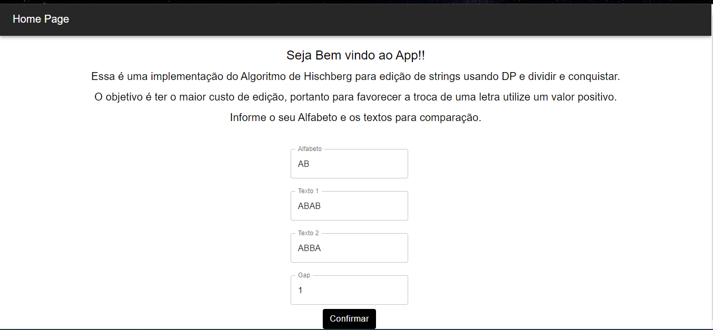
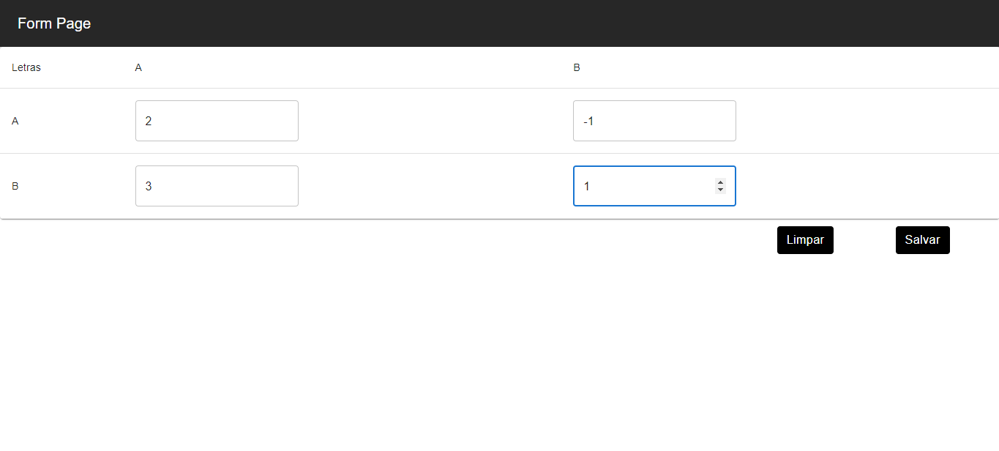
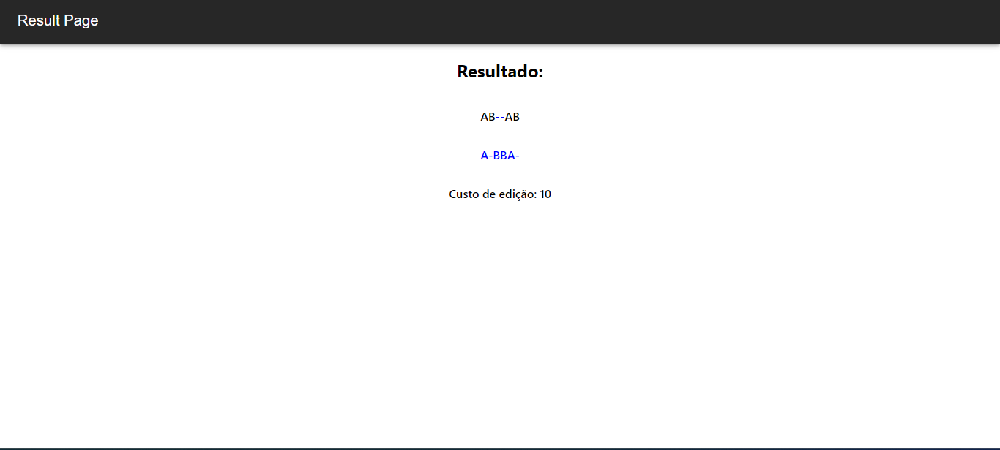

# Trabalho Final_DNFun

**Número da Lista**: 22 
**Conteúdo da Disciplina**: Programção Dinâmica e Dividir e conquistar 

## Alunos
|Matrícula | Aluno |
| -- | -- |
| 19/0047968  |  Paulo Vitor Silva Abi Acl |
| 16/0000572  |  Adrian Soares Lopes |

## Sobre 
 Essa é uma implementação do Algoritmo de Hischberg para edição de strings usando DP e dividir e conquistar, logo o objetivo é ter o maior custo de edição, portanto para favorecer a troca de uma letra informe sempre um valor positivo.

## Screenshots
Print 1:

Print 2:

Print 3:

## Instalação 

**Linguagem**: Python e Java Script 
**Framework**: React e FastApi 

Versões: 
Node v18 
Npm >= 7 
Python >= 3.10 

Para rodar o frontend acessa a pasta "front-end" instale as dependências com o comando `npm install` e use o `npm start` para iniciar o projeto. 

Para o backend acesse a pasta "backend", de preferência crie um ambiente isolado com o comando `python -m venv .venv` e ative-o: 
Windows: `.\.venv\Scripts\activate.bat`  
Linux: `. .venv/bin/activate`  

Depois disso instale as dependências com o comando `pip install -r requirements.txt` e para rodar use o comando `uvicorn main:app --host 0.0.0.0`

## Uso 
Informe o alfabeto, as duas strings de comparação e o gap, após essas informações preencha a matriz e terá seu resultado.

## Outros 
Obrigado!!

